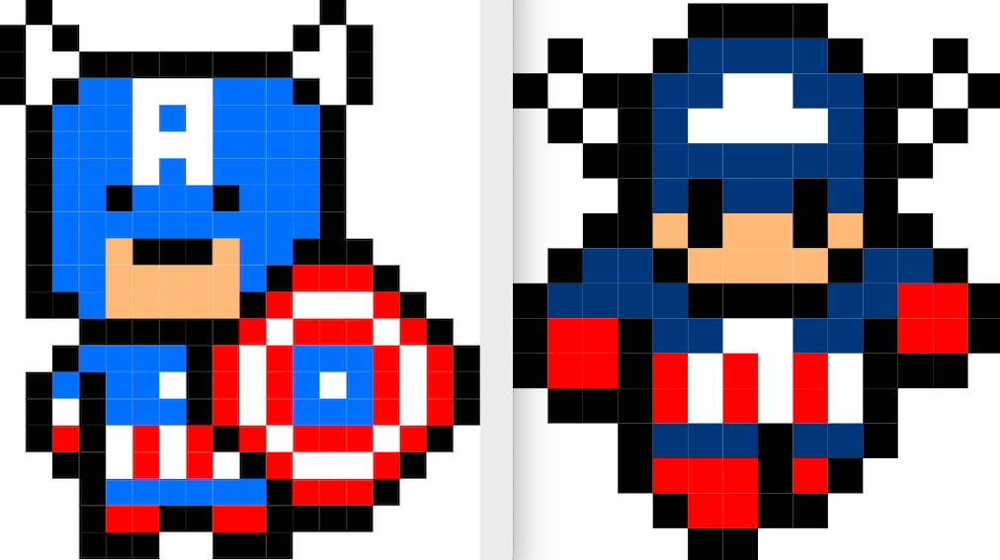

# Ejercicio ResponsiveSass 👩🏼‍🎤

Realizar dos dibujos utilizando HTML, CSS y SASS. El dibujo principal ha de visualizarse cuando el formato de pantalla es de desktop, y el secundario en formato mobile.

## Prerequisitos y herramientas 🛠

- Visual Studio Code
- Instalación de Sass
- Control de versiones con git
- Google Chrome

## Demo 📺

## Deploy ejercicio en Github pages 📱

https://crimanlor.github.io/Task1_responsive_SASS/
